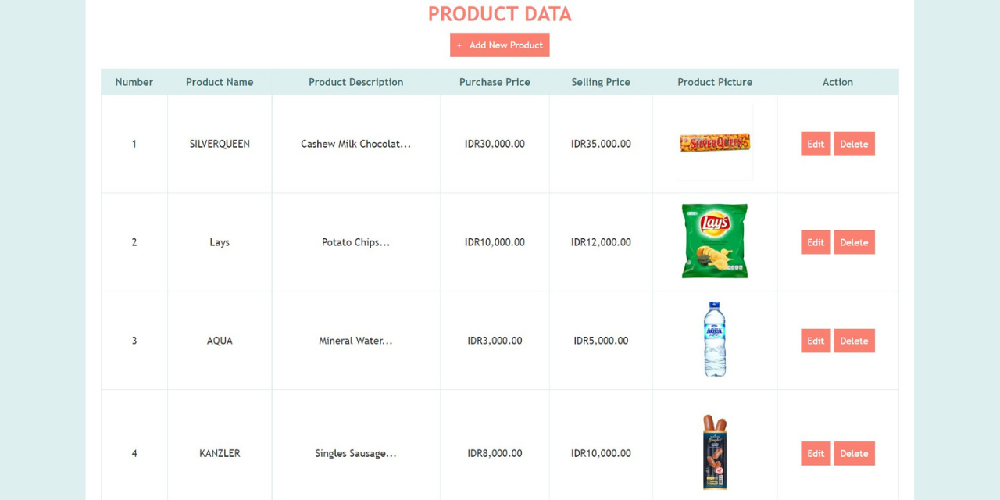

# Simple CRUD Table using PHP Programming Language
This is a project of the Server-Side Internet Programming course. In this project, I created a Simple Create, Read, Update and Delete (CRUD) Product Data Table using PHP programming language. There are several columns on the main page used to display the product data such as number, product name, product description, purchase price, selling price, product picture, and action (edit and delete). Besides that, the user can also add new product data, and edit and delete the data if it is needed and all of the data is connected to the database, to view the product data table, you may run the index.php file but to access this CRUD table is still using localhost.

